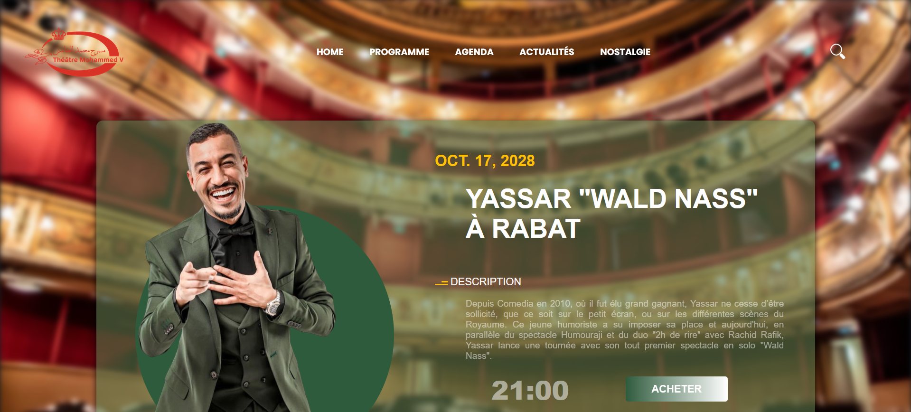

# Theater Website


## Description
Welcome to the Theater Website project! This project aims to create a dynamic website for a theater, allowing users to explore upcoming shows, purchase tickets, and learn more about the theater's offerings.

## Technologies Used
- Django
- Python
- HTML
- CSS
- JavaScript
- UML

## Requirements
Before running this project locally, make sure you have the following installed on your machine:
- Python
- Django

## Installation and Execution
1. Clone this repository to your machine:
   ```bash
   git clone https://github.com/l-ZaiDev-l/Theater-Website.git
2. cd your-project:
   ```bash
   cd Theater-Website
3. Install the required dependencies:
   ```bash
   pip install -r requirements.txt
4. Initialize the database and run migrations:
   ```bash
   python manage.py migrate
5. Start the development server:
   ```bash
   python manage.py runserver
6 Open the following address in your browser:
   ```bash
   http://localhost:8000/
   
Contributing
If you'd like to contribute to this project, please open a new issue or submit a pull request. We're open to suggestions and improvements!
